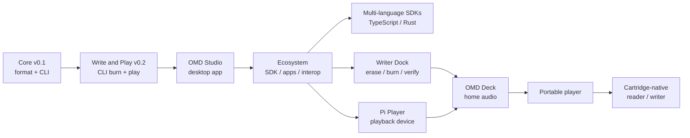

# Roadmap

Open Media Disc grows from a **software format** into **dedicated hardware**. The
strategy is deliberate: prove the format and media loop first, then solve the
harder mechanical problems. Nothing below the current milestone blocks the
format from being real today.

> Dates are intentionally omitted. Milestones ship when the previous one is
> solid.

## Where we are

**OMD Core v0.1: done as a private draft milestone.** Create, validate, inspect,
and preview OMD packages with the `omd` CLI and `@open-media-disc/core` SDK. No
hardware required. OMD has not reached its first stable format release, so v0.1
does not carry a backward-compatibility guarantee.
For a full breakdown of what is built versus what is left, see
[Project Status](./project-status.md).

**v0.2 Write and Play: done.** The CLI and SDK now build a burn-ready UDF disc
image, burn a package to 8cm DVD-RW and verify it (Windows), and play the album
with mpv or ffplay. See [Milestone: v0.2 Write and Play](#milestone-v02-write-and-play).

**OMD Studio (alpha): done.** A desktop and touch app (Electron) wrapping the
core for import, package, label, burn, verify, play, and rip, shipped as
`studio-v0.2.0`. The touch-first redesign that followed it (design tokens,
hub-and-spoke navigation, themes, Raspberry Pi tuning) is also delivered. See
[Milestone: OMD Studio (alpha)](#milestone-omd-studio-alpha) and the
[OMD Studio design note](./omd-studio.md). One acceptance item is outstanding: a
manual burn-and-play test of the redesigned app on real hardware.

**What is next: an ecosystem planning phase.** The next set of software
milestones is being chosen. Hardware milestones (writer dock, Pi player, deck,
portable, cartridge) are deliberately **parked** while the software ecosystem
grows.

## Milestone ladder

Everything to the right of "Ecosystem" is parked until the software ecosystem is
established.

## Milestones

| Milestone | Goal | Status |
| --- | --- | --- |
| **Core v0.1** | Initial draft package format: create, validate, inspect. | Done |
| **Write and Play (v0.2)** | Burn a package to 8cm DVD-RW and play it back from the CLI. | Done |
| **OMD Studio (alpha)** | Desktop and touch app wrapping the core: package, label, burn, play (themeable), and rip. | Done |
| **Next software milestones** | Growing the OMD ecosystem: SDK, spec, apps, integrations, accessibility. | Being planned |
| **Multi-language SDKs** | Shared conformance fixtures across TS (and later Rust). | Planned |
| **Writer Dock** | Dedicated device: erase, burn, verify, eject 8cm DVD-RW. | Parked |
| **Pi Player** | Raspberry Pi playback device reading bare OMD discs (the same touch-first Studio UI in kiosk mode). | Parked |
| **OMD Deck** | Component-style home-audio player. | Parked |
| **Portable player** | Battery, cache-first, MiniDisc-style handheld. | Parked |
| **Cartridge-native** | Spin an 8cm DVD-RW inside a serviceable cartridge shell. | Parked |

Hardware milestones are parked, not cancelled: the format and the software
ecosystem come first, and every software improvement makes the hardware cheaper
to build later.

## Milestone: v0.2 Write and Play

**Status: delivered in v0.2.0.**

**Goal.** Take a validated OMD package all the way to a playable physical disc:
build a burn-ready disc image, write it to 8cm DVD-RW, verify the burned disc, and
play a package back on the host machine. This proves the **media loop** (the
storage layer) on top of the proven package format.

### In scope

- Build a portable, burn-ready **UDF** disc image from a validated package.
- Verify the image, and the burned disc, against the package `CHECKSUMS.sha256`.
- Write the image to physical media through a cross-platform `BurnBackend` seam.
  The first backend targets **Windows (IMAPI2)**; Linux (`growisofs`/`xorriso`)
  and macOS (`drutil`) backends are planned follow-ups.
- Real audio playback with `omd play` using an installed player (`mpv`, with
  `ffplay` as a fallback, overridable via `--player` or `OMD_PLAYER`). The current
  no-audio preview stays as a last resort.
- Make `omd inspect` distinguish a package folder on disk from a mounted disc,
  degrading to the package label when the medium cannot be determined.
- Expose the flow as two CLI commands: `omd image` builds a reusable burn-ready
  image; `omd burn` writes a package or a prebuilt image to disc and verifies it,
  blanking a non-empty DVD-RW first.

### Non-goals

- No GUI: burning and playback stay on the CLI (OMD Studio is a later milestone).
- No dedicated hardware: the writer dock, Pi player, and cartridge shell come later.
- No cross-platform burning yet: Windows (IMAPI2) is the only backend in v0.2; the
  `BurnBackend` seam keeps Linux and macOS as future work.
- No built-in audio decoder: playback delegates to an installed player.
- No format expansion: still FLAC-in-a-package, no DVD-Audio or Blu-ray authoring.

### Exit criteria

- `spec/` defines the UDF disc image and on-disc layout (spec-first) and the
  public docs match.
- From a validated package you can build an image, burn it to an 8cm DVD-RW, and
  the burned disc verifies clean against its checksums.
- `omd play` produces real audio on a machine with `mpv` or `ffplay` installed.
- `omd inspect` correctly labels a package folder versus a mounted disc.
- `pnpm build`, `pnpm test`, and `pnpm lint` are green and the docs are updated.

**Platform note.** Burning is validated on Windows first, because that is where a
DVD writer is available for real hardware testing. The `BurnBackend` interface
keeps the other platforms as future backends without changing the format.

## Milestone: OMD Studio (alpha)

**Status: delivered as `studio-v0.2.0`.**

**Goal.** A desktop and touch app (Electron) that wraps the existing OMD core in
one surface: import or pick an album, package and validate it, generate a
printable label, burn and verify it to disc, play a mounted disc in an integrated,
themeable player, and rip a disc back to disk as a verified archival copy. The GUI
reuses the same core modules as the CLI, with no duplicated logic. See the
[OMD Studio design note](./omd-studio.md) for the shipped UI, the theming model,
and the `omd rip` design.

### In scope

- A new `@open-media-disc/studio` Electron app in this monorepo, reusing
  `@open-media-disc/core` directly in the main process.
- **Label generation:** a shared, cross-platform label module and an `omd label`
  command that render a printable album-art label sheet (mini CD jewel-case size
  by default) with crop marks. Studio prints it or exports a PDF.
- Studio screens for the full flow: a Home hub, Disc, Catalog, Create a Disc
  (source chooser plus burn with drive select, real media info, live progress,
  verify, and eject), Labels, Themes, and Settings.
- A **touch-first hub-and-spoke shell**: a Home hub of job tiles, screens reached
  from it, and a persistent transport dock. One UI serves the desktop window and
  the Raspberry Pi panel. See the [OMD Studio design note](./omd-studio.md).
- An integrated player: inspect a mounted disc, show album art and the track
  list, play, pause, and seek tracks, and verify checksums.
- A **themeable UI:** themes are `--omd-*` token maps over one shared component
  stylesheet, with a live picker and no per-theme stylesheet. Layout and
  interaction stay identical across themes.
- **Ripping (`omd rip`):** verified read-back of a mounted OMD disc to disk, as a
  re-burnable package or a friendly album folder, checked against the manifest
  checksums. A shared core function that Studio wraps.

### Non-goals

- No change to the disc format: `omdVersion` stays `0.1.0`.
- No cross-platform burning yet (burn stays Windows/IMAPI2; packaging, labels,
  and playback are cross-platform).
- No local catalog database in this alpha: the catalog is a plain folder that
  Studio scans and watches.
- No importable or community themes yet; the built-in token themes ship first.
- No installer or auto-update polish; a runnable build is the alpha bar.

### Exit criteria

- `omd label` produces a printable label sheet from a package, with tests.
- The Studio app drives the full flow end to end on Windows: import or pick an
  album, label, burn, verify, and play a mounted disc with seek.
- The UI is themeable through the `--omd-*` token contract (multiple built-in
  themes with a live picker), and no theme can change the layout.
- `omd rip` reads a mounted OMD disc back to disk (package or album mode) and
  verifies it against the manifest checksums, with tests.
- `pnpm build`, `pnpm test`, and `pnpm lint` stay green and the docs are updated.

**Build order.** The shared label module and `omd label` first (cross-platform
and testable), then the Electron scaffold, then the flow screens, then the
integrated player, then theming and `omd rip` (shared, verified read-back), both
cross-platform and testable.

## What's explicitly *out of scope* for v0.1

Optical burning, UDF/ISO image creation, Raspberry Pi device services, hardware
control, cartridge mechanics, GUI/desktop/mobile apps, cloud accounts, DRM,
DVD-Audio/Blu-ray authoring, marketplace features, and streaming integration.
Each becomes viable only after the format is proven across many real albums.
**v0.2 Write and Play** brings optical burning and UDF image creation into scope;
the rest stay deferred to their milestones above.

## Design commitments that won't change lightly

- **Spec-first.** The format is defined by specs, schema, and fixtures, not by
  any single tool's output.
- **Recoverable media.** Files stay browsable and restorable with ordinary tools.
- **Format vs. software versioning stays separate.** A tool release never
  silently changes the disc format.

See [What is OMD?](./what-is-omd.md) for the underlying vision.
