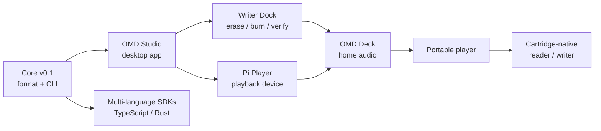

# Roadmap

Open Media Disc grows from a **software format** into **dedicated hardware**. The
strategy is deliberate: prove the format and media loop first, then solve the
harder mechanical problems. Nothing below the current milestone blocks the
format from being real today.

> Dates are intentionally omitted. Milestones ship when the previous one is
> solid.

## Where we are

**OMD Core v0.1 — done.** Create, validate, inspect, and preview OMD packages
with the `omd` CLI and `@open-album-cartridge/core` SDK. No hardware required.
For a full breakdown of what is built versus what is left, see
[Project Status](./project-status.md).

## Milestone ladder

## Milestones

| Milestone | Goal | Status |
| --- | --- | --- |
| **Core v0.1** | Stable package format: create, validate, inspect. | ✅ Done |
| **OMD Studio (alpha)** | Desktop tool wrapping the core: package, label, burn. | Planned |
| **Multi-language SDKs** | Shared conformance fixtures across TS (and later Rust). | Planned |
| **Writer Dock** | Dedicated device: erase → burn → verify → eject 8cm DVD-RW. | Planned |
| **Pi Player** | Raspberry Pi playback device reading bare OMD discs. | Planned |
| **OMD Deck** | Component-style home-audio player. | Research |
| **Portable player** | Battery, cache-first, MiniDisc-style handheld. | Research |
| **Cartridge-native** | Spin an 8cm DVD-RW inside a serviceable cartridge shell. | Long-term R&D |

## What's explicitly *out of scope* for v0.1

Optical burning, UDF/ISO image creation, Raspberry Pi device services, hardware
control, cartridge mechanics, GUI/desktop/mobile apps, cloud accounts, DRM,
DVD-Audio/Blu-ray authoring, marketplace features, and streaming integration.
Each becomes viable only after the format is proven across many real albums.

## Design commitments that won't change lightly

- **Spec-first.** The format is defined by specs, schema, and fixtures — not by
  any single tool's output.
- **Recoverable media.** Files stay browsable and restorable with ordinary tools.
- **Format vs. software versioning stays separate.** A tool release never
  silently changes the disc format.

See [What is OMD?](./what-is-omd.md) for the underlying vision.
