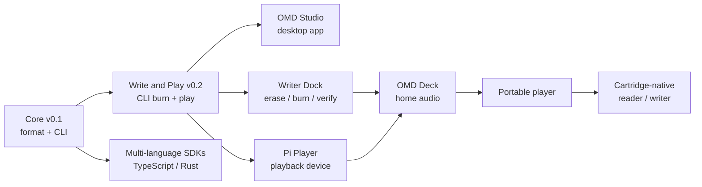

# Roadmap

Open Media Disc grows from a **software format** into **dedicated hardware**. The
strategy is deliberate: prove the format and media loop first, then solve the
harder mechanical problems. Nothing below the current milestone blocks the
format from being real today.

> Dates are intentionally omitted. Milestones ship when the previous one is
> solid.

## Where we are

**OMD Core v0.1: done.** Create, validate, inspect, and preview OMD packages
with the `omd` CLI and `@open-album-cartridge/core` SDK. No hardware required.
For a full breakdown of what is built versus what is left, see
[Project Status](./project-status.md).

**Next up: v0.2 Write and Play (in progress).** Build a burn-ready disc image,
write a package to physical 8cm DVD-RW, and play it back from the CLI. See
[Next milestone: v0.2 Write and Play](#next-milestone-v02-write-and-play) below.

## Milestone ladder

## Milestones

| Milestone | Goal | Status |
| --- | --- | --- |
| **Core v0.1** | Stable package format: create, validate, inspect. | ✅ Done |
| **Write and Play (v0.2)** | Burn a package to 8cm DVD-RW and play it back from the CLI. | In progress |
| **OMD Studio (alpha)** | Desktop tool wrapping the core: package, label, burn. | Planned |
| **Multi-language SDKs** | Shared conformance fixtures across TS (and later Rust). | Planned |
| **Writer Dock** | Dedicated device: erase → burn → verify → eject 8cm DVD-RW. | Planned |
| **Pi Player** | Raspberry Pi playback device reading bare OMD discs. | Planned |
| **OMD Deck** | Component-style home-audio player. | Research |
| **Portable player** | Battery, cache-first, MiniDisc-style handheld. | Research |
| **Cartridge-native** | Spin an 8cm DVD-RW inside a serviceable cartridge shell. | Long-term R&D |

## Next milestone: v0.2 Write and Play

**Goal.** Take a validated OMD package all the way to a playable physical disc:
build a burn-ready disc image, write it to 8cm DVD-RW, verify the burned disc, and
play a package back on the host machine. This proves the **media loop** (the
storage layer) on top of the proven package format.

### In scope

- Build a portable, burn-ready **UDF** disc image from a validated package.
- Verify the image, and the burned disc, against the package `CHECKSUMS.sha256`.
- Write the image to physical media through a cross-platform `BurnBackend` seam.
  The first backend targets **Windows (IMAPI2)**; Linux (`growisofs`/`xorriso`)
  and macOS (`drutil`) backends are planned follow-ups.
- Real audio playback with `omd play` using an installed player (`mpv`, with
  `ffplay` as a fallback). The current no-audio preview stays as a last resort.
- Make `omd inspect` distinguish a package folder on disk from a mounted disc.

### Exit criteria

- `spec/` defines the UDF disc image and on-disc layout (spec-first) and the
  public docs match.
- From a validated package you can build an image, burn it to an 8cm DVD-RW, and
  the burned disc verifies clean against its checksums.
- `omd play` produces real audio on a machine with `mpv` or `ffplay` installed.
- `omd inspect` correctly labels a package folder versus a mounted disc.
- `pnpm build`, `pnpm test`, and `pnpm lint` are green and the docs are updated.

**Platform note.** Burning is validated on Windows first, because that is where a
DVD writer is available for real hardware testing. The `BurnBackend` interface
keeps the other platforms as future backends without changing the format.

## What's explicitly *out of scope* for v0.1

Optical burning, UDF/ISO image creation, Raspberry Pi device services, hardware
control, cartridge mechanics, GUI/desktop/mobile apps, cloud accounts, DRM,
DVD-Audio/Blu-ray authoring, marketplace features, and streaming integration.
Each becomes viable only after the format is proven across many real albums.
**v0.2 Write and Play** brings optical burning and UDF image creation into scope;
the rest stay deferred to their milestones above.

## Design commitments that won't change lightly

- **Spec-first.** The format is defined by specs, schema, and fixtures, not by
  any single tool's output.
- **Recoverable media.** Files stay browsable and restorable with ordinary tools.
- **Format vs. software versioning stays separate.** A tool release never
  silently changes the disc format.

See [What is OMD?](./what-is-omd.md) for the underlying vision.
