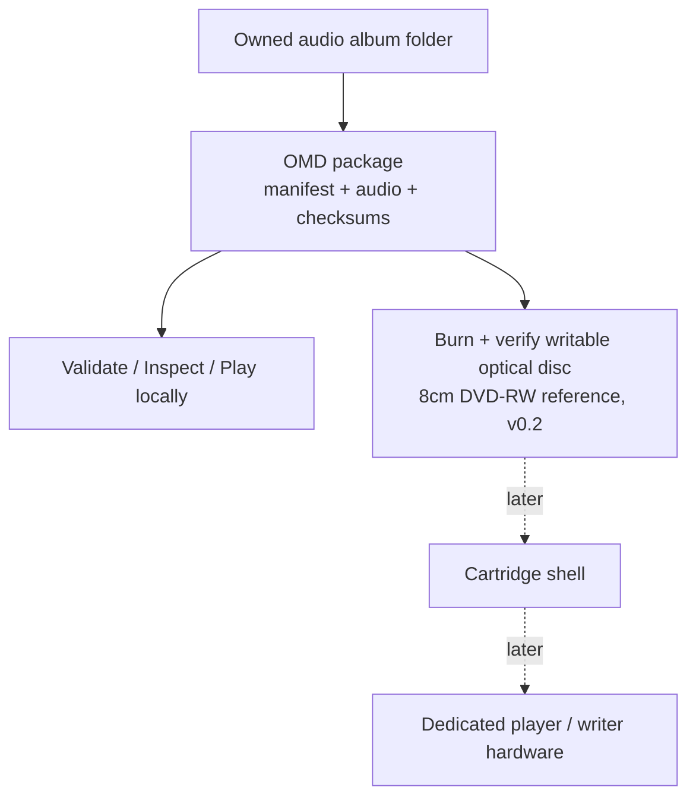

# What is Open Media Disc?

**Open Media Disc (OMD)** is an open-source **physical music format**. It turns
an album folder of audio files into a verified, self-describing package that can
be burned to cheap, rewritable optical discs, a MiniDisc/UMD-style ritual for
affordable, personal album ownership. The current format uses plain files on a
UDF disc. Its reference medium is 8cm DVD-RW, but the same package can be
written to a CD, a standard DVD, or a Blu-ray.

The current private draft permits one package codec chosen from FLAC, MP3, AAC,
Vorbis, Opus, or WAV. The planned first stable contract narrows package codecs
to FLAC and MP3 while allowing more source formats during import. The plan is
not yet implemented; see [Package Format](./package-format.md#codec-status).

## The one-line idea

> A recorded blank should feel like a legitimate album object, not a homemade
> substitute. OMD makes the digital-to-physical album experience compelling for
> collectors and independent artists before dedicated hardware exists.

## Why it exists

Streaming is convenient but intangible. Vinyl is satisfying but expensive.
MiniDisc offers the compact physical experience OMD wants to revive, but its
players and media are increasingly rare. Generic storage has no shelf presence
or ritual. OMD aims for the gap:

- **Album-object psychology**: a labelable, collectable, finished object.
- **Cheap and rewritable**: commodity optical media you can erase and reburn; 8cm
  DVD-RW is the reference, but any standard writable disc works.
- **Practical for artists**: independent artists can create short runs without a
  pressing plant or a large manufacturing minimum.
- **Open and recoverable**: standard audio files, JSON, and SHA-256 data readable with
  ordinary tools, never locked inside a proprietary silo.

## The layered design

OMD separates the _format_ from the _hardware_ so the format can be proven first.

**The cartridge is the eventual flagship physical experience, not a requirement
for using the open format.** v0.1 proved the software package format; v0.2 adds
the media loop (burning to and verifying a writable optical disc, defaulting to
8cm DVD-RW). Commodity media and open software make OMD useful now. Grassroots
adoption by collectors and independent artists creates the reason to build the
protected cartridge, dedicated drives, and players later.

## Core design principles

- **Spec first, implementation second.** The format is defined by written specs,
  a JSON Schema, and validation rules, not by "whatever a tool happens to emit."
- **The disc stays recoverable.** Files are directly browsable and restorable
  from any computer drive. The format must be debuggable outside its ecosystem.
- **Album-first, not folder-first.** A player reads the manifest and shows an
  album, never a file browser.
- **Digital-to-physical first.** The central workflow turns a legally owned
  digital album into a credible physical release.
- **Deterministic and verifiable.** Every package carries checksums; the same
  input produces the same output.
- **Don't block on the hard part.** Cartridge mechanics come only after the
  software ecosystem proves demand.

## What OMD is _not_

- Not a generic backup or data-disc tool.
- Not DVD-Audio, DVD-Video, or Blu-ray authoring.
- Not a streaming service, cloud account, or DRM system.
- Not a vinyl replacement: it's a different, cheaper ritual.

## Why ordinary audio files, not DVD-Audio?

DVD-Audio is optimized for authored, audiophile disc releases and niche players.
OMD is optimized for cheap, repeatable, personal album writing and rewriting with
directly recoverable files. Keeping a small, explicit package-codec set makes the
format straightforward to author, validate, recover, and parse, including on
future embedded players. The current draft's six-codec set is expected to become
FLAC and MP3 for the first stable contract. DVD-Audio may become an optional
export mode later; it is not the native format.

## Where to go next

- Ready to build a package? → [Getting Started](./getting-started.md)
- Want the exact package anatomy? → [Package Format](./package-format.md)
- Curious about the hardware plans? → [Roadmap](./roadmap.md)
