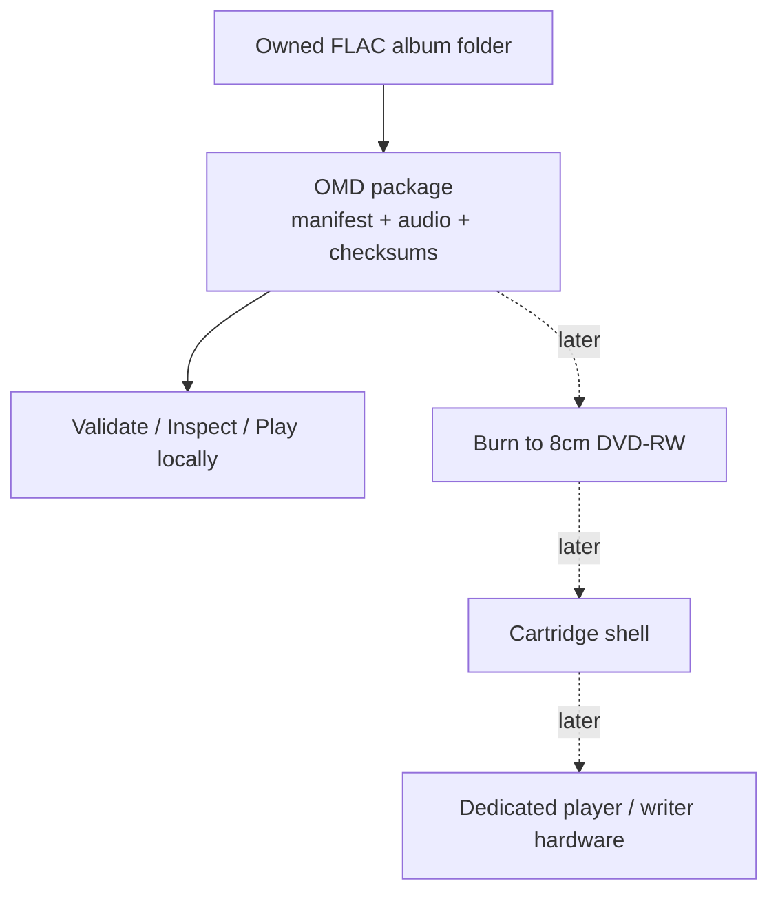

# What is Open Media Disc?

**Open Media Disc (OMD)** is an open-source **physical music format**. It turns
an album folder of FLAC files into a verified, self-describing package that can
later be burned to cheap, rewritable 8cm DVD-RW media — a MiniDisc/UMD-style
ritual for affordable, personal album ownership.

## The one-line idea

> A recorded blank should feel like a legitimate album object, not a homemade
> substitute. OMD gives owned digital albums a satisfying physical form using
> commodity optical media.

## Why it exists

Streaming is convenient but intangible. Vinyl is satisfying but expensive.
SD cards store music but have no shelf presence or ritual. OMD aims for the gap:

- **Album-object psychology** — a labelable, collectable, finished object.
- **Cheap and rewritable** — commodity 8cm DVD-RW media you can erase and reburn.
- **Open and recoverable** — plain files (FLAC, JSON, SHA-256) readable with
  ordinary tools, never locked inside a proprietary silo.

## The layered design

OMD separates the *format* from the *hardware* so the format can be proven first.

**The cartridge is the format; the DVD-RW is the storage layer.** At v0.1 there
is no cartridge and no burning — only the software package format.

## Core design principles

- **Spec first, implementation second.** The format is defined by written specs,
  a JSON Schema, and validation rules — not by "whatever a tool happens to emit."
- **The disc stays recoverable.** Files are directly browsable and restorable
  from any computer drive. The format must be debuggable outside its ecosystem.
- **Album-first, not folder-first.** A player reads the manifest and shows an
  album, never a file browser.
- **Deterministic and verifiable.** Every package carries checksums; the same
  input produces the same output.
- **Don't block on the hard part.** Cartridge mechanics come only after the
  software/media loop is proven.

## What OMD is *not*

- Not a generic backup or data-disc tool.
- Not DVD-Audio, DVD-Video, or Blu-ray authoring.
- Not a streaming service, cloud account, or DRM system.
- Not a vinyl replacement — it's a different, cheaper ritual.

## Why FLAC data (not DVD-Audio)?

DVD-Audio is optimized for authored, audiophile disc releases and niche players.
OMD is optimized for cheap, repeatable, personal album writing and rewriting with
directly recoverable files. FLAC-in-a-data-package keeps the format simple to
author, validate, and parse — including on future embedded players. DVD-Audio
may become an optional export mode later; it is not the native format.

## Where to go next

- Ready to build a package? → [Getting Started](./getting-started.md)
- Want the exact package anatomy? → [Package Format](./package-format.md)
- Curious about the hardware plans? → [Roadmap](./roadmap.md)
